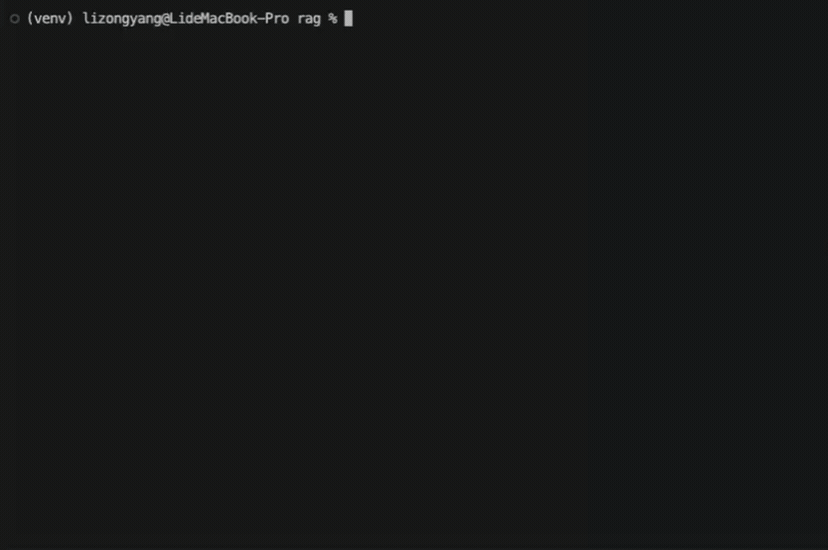

# CruxBot



Hybrid-retrieval RAG over 338,433 rock climbing documents — routes, forum
threads, accident reports, and gear reviews — with a retrieval evaluation
harness that measures the retriever separately from the generator.

> **Status: in progress.** Two-stage retrieval, the indexing pipeline, the
> labelled retrieval benchmark, and 350 tests under CI are all in place. The
> remaining gaps are a hosted demo and answer-quality evaluation. This README
> documents what exists; sections marked *(planned)* do not.

---

## Why this repo exists

Most RAG demos cannot tell you whether their retrieval works. They report
end-to-end answer quality, which conflates the retriever, the prompt, and the
model — so "we added hybrid search and it got better" is unfalsifiable.

This project takes the opposite position:

- **The retriever is measured on its own** — Recall@k, MRR, nDCG@k against a
  pooled, judged query set, with each ablation changing exactly one variable.
  That measurement has already overturned one inherited assumption: query intent
  detection, which the predecessor counted as an improvement, costs 79% more p95
  latency and buys no measurable quality. See [Evaluation](#evaluation).
- **Metrics are named for what they measure.** The predecessor project reported
  a "90% pass rate" that, read closely, only checked whether an answer avoided a
  refusal phrase. It measured false-refusal rate, which is a real and useful
  number — but it is not accuracy, and it is not labelled as accuracy here.
- **Known failure modes are pinned as tests**, not omitted. See
  `TestKnownLimitations` in [tests/test_intent.py](tests/test_intent.py).

---

## Architecture

```
Query
  │
  ├─► grades.expand_query()    YDS ↔ French ↔ V ↔ Font normalization
  │                            (intent.detect() exists but is off by
  │                             default — measured as a regression)
  ▼
Stage 1 — recall over 384k chunks
  ├─ dense   (bge-small-en-v1.5 + ChromaDB)  ─┐
  └─ sparse  (BM25 inverted index)           ─┴─► rrf_merge() ─► ~50 candidates
                                                                      │
                                                                      ▼
Stage 2 — precision over ~50            cross-encoder rerank ─► top 5
                                                                      │
                                                                      ▼
  prompts.build()  ─►  LLMProvider  ─►  answer + citations
                       (Ollama / hosted API)
```

### Design notes

**Why the core has no dependencies.** `grades`, `intent`, `fusion`, `urls`,
`prompts`, `chunking`, the BM25 index, and the ranking metrics import nothing
outside the standard library. The embedding model, vector store, reranker, and
relevance judge are all injected behind Protocols, so retrieval and evaluation
are tested against in-memory doubles. CI installs no `torch` and makes no
network calls; the whole suite runs in well under a second, which is why it can
run on every push.

**Why a hand-written BM25 instead of `rank_bm25`.** `rank_bm25.get_scores`
scores every document in the corpus on every query: at 382k documents that is
382k operations per query term, whether or not the term appears anywhere. An
inverted index makes the cost proportional to the postings actually touched,
which for a typical term is well under 1% of the corpus. It also removes a
dependency and keeps the module testable in CI.

**Why the sparse index stores postings as packed arrays.** It holds term
statistics only — text for a chunk found by BM25 alone is hydrated from the
vector store in one batched lookup after fusion. That alone was not enough:
the first build, with no text stored, still came to 681 MB, *larger* than the
predecessor's 633 MB cache. The cost was the representation. 26.5M postings
held as small Python objects pickle to roughly 27 bytes each; the same data as
two parallel `array("i")` per term is 8, and unpickles as raw bytes rather than
26.5M constructor calls.

| | objects | packed arrays |
| --- | --- | --- |
| on disk | 681 MB | **277 MB** |
| load | 6.1 s | **0.35 s** |
| build | 113 s | **21 s** |
| filtered search | 159 ms | **38 ms** |

The search figure is a separate fix: content-type positions are now precomputed
at build time. Deriving them per query meant scanning all 384k documents on
every filtered search, which made filtering *cost* rather than save time.

**A measured limit of ChromaDB.** Metadata filtering does not use the HNSW
index — an unfiltered query returns in 2 ms, the same query with a
`content_type` filter takes 390 ms. This is now the dominant term in retrieval
latency, and it is the concrete form of the ceiling described above rather than
a hypothetical one.

**Why ChromaDB.** 382k vectors × 384 dims fits comfortably in memory on a
single node, and Chroma needs no separate service to operate. This is a
deliberate ceiling: at roughly 10M vectors, or once multi-replica reads matter,
the right move is pgvector or Qdrant. Chroma is not being defended as a
production vector store — it is being used where its limits do not bind.

**Why a small embedding model.** Under a two-stage architecture the first stage
is judged on Recall@50 — did the right chunk reach the candidate pool at all —
not on ranking it first, which is the cross-encoder's job. That weakens the case
for a larger bi-encoder considerably. Measured on an M4, `bge-small` indexes
384k chunks at 238/s against `bge-base`'s 91/s: 27 minutes versus 67, and a
smaller index. Whether the reranker actually absorbs the quality difference is a
question for the benchmark, not for taste — the comparison is one row of the
table below.

**Why two LLM backends.** A self-hosted Llama 3 costs nothing per query and
sends nothing to a third party, which is right for bulk evaluation and for
anyone running this locally. A hosted Claude model needs no GPU and no local
install, which is the only thing that deploys — "the operator has Ollama
running" is not a deployment story. Both sit behind
[`LLMProvider`](src/cruxbot/llm/base.py), so evaluation can hold the retriever
fixed and swap only the generator, and `CRUXBOT_LLM_PROVIDER` chooses at
startup. A provider that fails to construct does not stop the service: search
comes up regardless, and `/health` reports why generation is missing.

**What incremental indexing requires.** Chunk ids are derived from document
ids, so re-indexing a changed document overwrites its chunks instead of
appending a second copy. Full and incremental runs are therefore the same
command over a different input file. Only the dense index is incremental; BM25's
statistics are corpus-global, so it is rebuilt — minutes at this size.

---

## Layout

```
src/cruxbot/
├── grades.py           # grade normalization       (pure, no deps)
├── intent.py           # query intent detection    (pure, no deps)
├── fusion.py           # reciprocal rank fusion    (pure, no deps)
├── urls.py             # citation quality checks   (pure, no deps)
├── prompts.py          # prompt construction       (pure, no deps)
├── types.py            # Chunk / Source / Answer
├── config.py           # env-driven settings
├── llm/
│   ├── base.py         # LLMProvider Protocol
│   └── ollama.py       # local backend
├── indexing/
│   ├── chunking.py     # per-content-type splitting (pure, no deps)
│   ├── corpus.py       # streaming JSON / JSONL loader
│   └── pipeline.py     # chunk -> embed -> upsert, full or incremental
└── retrieval/
    ├── sparse.py       # BM25 inverted index       (pure, no deps)
    ├── dense.py        # Embedder / VectorStore Protocols + Chroma backend
    ├── rerank.py       # cross-encoder second stage
    └── hybrid.py       # intent routing, fusion, hydration, rerank
scripts/               # CLI: index builds, eval set, ablation, demo subset
tests/                  # 350 tests; no torch, no network
```

---

## Running it

The full index is 2.5 GB and is not published. A 40,000-chunk subset is — a 10%
sample that includes every passage the benchmark judged, so the queries in
`benchmarks/queries.jsonl` return the passages behind the numbers below.

```bash
scripts/fetch_demo_index.sh   # ~167 MB download, ~300 MB unpacked
docker compose up             # first start pulls ~500 MB of model weights

python scripts/demo.py "classic 5.11a sport routes in Yosemite"
```

`scripts/demo.py` needs nothing installed — it is stdlib-only, so it works
straight after `docker compose up`. It prints the retrieved passages with their
rerank scores and the per-stage timing, then streams the answer. Pass
`--search-only` to skip generation.

`/search` needs no model provider and spends no tokens. `/answer` does — either
a hosted model (`CRUXBOT_LLM_PROVIDER=anthropic docker compose up`, reading
`ANTHROPIC_API_KEY` from a gitignored `.env`) or a local one
(`docker compose --profile local-llm up`). Without one, `/answer` returns 503 and says so
while `/search` keeps working — `/health` probes the provider rather than
assuming a configured one is reachable.

**On latency in the container.** Retrieval measures p50 1192 ms natively on an
M4, where the cross-encoder runs on the GPU. Inside Docker it is CPU-only and
the same rerank takes 5–8 s. The container is for reproducibility, not for
speed; run the service natively to see the numbers in the benchmark below.

| endpoint | what it does |
| -------- | ------------ |
| `POST /search` | Retrieval only. Returns passages, scores, and per-stage timing. |
| `POST /answer` | Retrieval plus generation, streamed as SSE; sources arrive before the first token. |
| `GET /health` | Reports retrieval and generation availability separately. |

### Development

```bash
python -m venv .venv && source .venv/bin/activate
make install        # core + pytest + ruff, no torch
make check          # lint + tests
```

The full stack installs separately:

```bash
make install-all
```

Building the index from the unified corpus:

```bash
# full build: 338,433 documents -> 384,315 chunks, ~32 min on an M4
python scripts/build_index.py --corpus data/unified.jsonl

# incremental: same command, a smaller input, no BM25 rebuild
python scripts/build_index.py --corpus data/incoming/reddit-latest.jsonl --skip-sparse

# the shippable subset, reusing the vectors already computed
python scripts/build_demo_index.py --size 40000
```

Tests that need a built index or a running model are marked `integration` and
excluded by default.

---

## Evaluation

Retrieval is scored against 40 climbing queries whose candidate pools were
built by **pooling** — every configuration below contributes its top 10, the
union is graded 0–3 by Claude Opus 5, and anything unjudged counts as
irrelevant. Pooling is what makes the comparison fair: labelling from one
configuration's output would guarantee that configuration wins. 38 of the 40
queries have at least one passage graded 2 or higher and are scored; the other
two found nothing relevant in the corpus at all.

Each row differs from the one above it in exactly one variable.

| configuration        | Recall@50 | Recall@10 | nDCG@10   | MRR       | p50 ms | p95 ms |
| -------------------- | --------- | --------- | --------- | --------- | ------ | ------ |
| dense                | 0.693     | 0.420     | 0.527     | 0.603     | 57     | 107    |
| sparse               | 0.473     | 0.267     | 0.369     | 0.402     | 110    | 211    |
| hybrid               | **0.950** | 0.443     | 0.563     | 0.623     | 139    | 228    |
| hybrid+intent        | 0.920     | 0.446     | 0.559     | 0.590     | 321    | 1850   |
| **hybrid+rerank**    | **0.950** | 0.646     | **0.667** | 0.757     | 1279   | 1929   |
| hybrid+intent+rerank | 0.920     | **0.647** | 0.665     | **0.776** | 1319   | 3462   |

Recall@50 is reported because it measures the first stage on its own terms:
whether the right passage reached the pool the cross-encoder sees. Recall,
Precision and MRR count a passage as relevant at grade ≥ 2 ("useful but
partial"); grade 1 is "on topic but does not address the question", which is
not something a retriever should be credited for finding. nDCG stays graded.

**What the table says.**

*Hybrid retrieval works, and it works on recall.* Recall@50 rises from 0.693 to
0.950 — but Recall@10 barely moves, 0.420 to 0.443. Combining BM25 with dense
retrieval pulls far more relevant passages into the candidate pool without
ranking them any better. That is the argument for a second stage, stated as a
measurement rather than an intuition.

*The cross-encoder delivers what the first stage could not.* Adding it to
`hybrid` lifts Recall@10 by 46%, nDCG@10 by 18%, and MRR by 22%, at roughly a
second of added latency. The two-stage split — recall over 384k, precision over
50 — is doing exactly what it is supposed to.

*Query intent detection does not earn its place, and has been switched off.*
Comparing the last two rows:
no measurable quality difference (nDCG differs by 0.002, MRR by 0.019 — noise
at 38 queries), a lower Recall@50, and a p95 latency 79% higher. The extra
1.5 seconds buys nothing. Most of that cost is ChromaDB's metadata filter,
which does not use the HNSW index. The predecessor project counted intent
detection among the changes that improved its results; under an attributable
measurement it is a regression. `use_intent` now defaults to `False`, which
takes the default path off the metadata filter entirely: end-to-end retrieval
measures p50 1192 ms / p95 1811 ms, against p95 3462 ms with the prior on. The
module and its tests stay so the ablation row remains reproducible.

**Limitations.** 38 scored queries is small — differences under roughly 0.05
should not be read as real, which is why the intent comparison above is stated
as "no measurable difference" rather than a winner. The labels are machine
graded; agreement against human grades is measurable with
`evaluation.judge.agreement` but has not yet been run. Pooling penalises any
configuration added after judging, so the table cannot be extended without
rebuilding the pool.

Reproduce with:

```bash
python scripts/build_eval_set.py     # pool + judge  (~8 min, ~$2 of API)
python scripts/evaluate_retrieval.py # score every configuration
```

---

## Acknowledgements

This project began as **CS 6120 (Natural Language Processing), Northeastern
University**, built by a team of four:
[zongyang078/CruxBot](https://github.com/zongyang078/CruxBot).

In the original repository:

- **Sherwin Vahidimowlavi** wrote the chunking and embedding pipelines and built
  the initial 382k-vector ChromaDB index.
- **Lingyun Xiao** wrote the FastAPI backend, the Docker and GCP deployment, and
  the LLM-as-Judge evaluation framework.
- **Linxuan Li** wrote the initial dense-retrieval logic and RAG orchestration.
- **Zongyang Li** (this repository's author) wrote the data collection and
  cleaning pipeline for all six sources, the hybrid BM25 + dense + RRF
  retrieval, query intent detection, grade normalization, the anti-hallucination
  prompt design, and the 50-query evaluation suite.

This repository is a solo rebuild. It carries forward the collected dataset and
the retrieval logic, and replaces the chunking, embedding, evaluation, and
serving layers with new implementations. Where an idea originated in a
teammate's work, it is credited above; where their code has been replaced, the
replacement is mine.

---

## License

MIT — see [LICENSE](LICENSE).

Source data is used under the terms of each provider: OpenBeta (CC0), American
Alpine Club (CC0), Kaggle datasets (per-author copyright), Reddit (API ToS).
